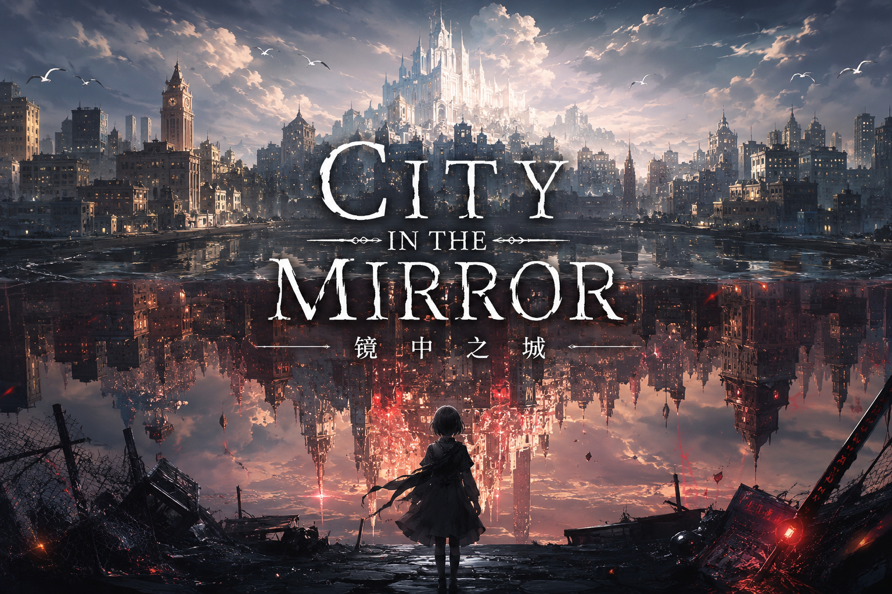

<div align="center">



# 镜 中 城 · City of Mirrors

**一座被镜墙劈成两半的城市。左边，真话如刀；右边，蜜语如糖。你是唯一能同时说两种话的人——但你真正要学的，不是分辨真假，而是何时诚实、何时温柔。**

[](https://www.renpy.org/)
[]()
[]()
[]()
[]()

</div>

---

## 📖 故事

> *"你醒来时，面前是一面镜子。镜子里的人，是你。但你不知道那是谁。"*

一道镜墙将一个文明劈成两半，造出了两座互为镜像的城市——

| 🪨 左城 · 言真之地 | 🌸 右城 · 言美之地 |
|:---:|:---:|
| 真话有物理力量 | 假话有美化力量 |
| 每句真话如刻刀，冷蓝的光中建筑棱角分明 | 每句赞美如蜜糖，暖金的光里一切温柔美好 |
| 人们沉默着表达敬意 | 人们微笑着掩盖恐惧 |
| **极端的诚实，让一切结冰** | **极端的温柔，让一切悬空** |

你——**勿言**——从镜墙裂缝中醒来，没有记忆，却拥有这片土地上独一无二的能力：**你能同时说出真话和假话**。在左城你会看到诚实如何冻结一个人的灵魂；在右城你会目睹谎言如何撑起一座摇摇欲坠的城。而你要做的，不是选择站哪一边，而是——

> **"找到恰好。在对的时刻，用对的方式，说对的话。"**

这面镜墙是谁建的？你为什么能穿越它？你的过去藏在这座城市裂缝的何处？——七个章节，十二段记忆，十三位角色的命运，将由你的每一次开口而改变。

---

## 🎮 核心机制

### 🎡 语言轮盘

每个关键对话会激活**语言轮盘**——这是游戏最核心的交互：

| 选项 | 符号 | 本质 | UI 颜色 |
|:---|:---:|:---|:---|
| **真话** | ❄ | 切割力 — 揭露真相，可能伤人 | `#4A90D9` 冷蓝 |
| **假话** | ✿ | 治愈力 — 安抚痛苦，可能失实 | `#D4A574` 暖金 |
| **沉默** | · | 存在力 — 给予空间，可能被误解 | `#9B9B9B` 中灰 |

> 💡 沉默选项**故意隐藏**——没有任何提示，需要玩家自己发现。按 `S` 键可直接选择沉默。

### 🪞 镜像值系统

每一个选择都在水面上留下涟漪，涟漪的形状就是你的形状：

```
冷蓝 ■■■■■■■■□□□□□□□□□□□□ 暖金
     真话倾向                    假话倾向
```

| 对齐类型 | 触发条件 | 称号 |
|:---|:---|:---|
| 真话倾向 >70% | 你说的大多是真话 | **言真者** |
| 假话倾向 >70% | 你说的大多是假话 | **织谎者** |
| 沉默 >40% | 你选择了最安静的路 | **沉默者** |
| 真话和假话在 30%-70% | 你找到了中间地带 | **渡者** |
| 初始状态 | 一切尚未定型 | **行者** |

> 镜像值会**动态改变整个 UI 的色调**——从冷蓝到暖金，你的屏幕就是你的镜子。

### 🏙️ 城市健康度

左城和右城各有 100 点健康度。你的选择不仅影响角色关系，更会影响整座城市的命运：

- **健康**（70-100）—— 城市运转如常
- **不稳定**（40-69）—— 建筑出现裂痕，NPC 行为改变
- **危机**（0-39）—— 城市面临崩塌，关键剧情触发

### 🧩 记忆碎片

12 块散落在各章节的记忆碎片，拼凑出勿言失落的过去。全部收集将解锁**后日谈**——游戏真正的结局。

### 🏆 成就系统

16 个成就分为四类：章节 × 7 · 特殊选择 × 3 · 收集 × 2 · 隐藏 × 4

---

## 🌍 角色

### 🎭 主角

| 角色 | 描述 |
|:---|:---|
| **勿言** | 失忆者。面孔模糊，灰色长袍。唯一能穿越镜墙、同时说真话和假话的人。由你的选择塑造性格。 |

### 🪨 左城

| 角色 | 年龄 | 身份 | 弧线 |
|:---|:---|:---|:---|
| **白岁** — 石匠 | 62 | 沉默的雕刻家，等妻子等了二十年 | 从「沉默是保护」到「有些话值得说」 |
| **小雪** — 少女 | 14 | 真话学院学生，害怕开口伤人 | 从「真话是唯一」到「沉默也是真话」 |
| **石言** — 长老 | 78 | 极端真话主义者，曾因一句假话失去家人 | 从「消灭假话」到「也许我需要一句温柔的真话」 |
| **岩** — 医生 | — | 左城最好的外科医生，忘了怎么笑 | 重新学会笑 |
| **砾** — 少年 | 17 | 用真话写诗的人 | 跨越镜墙的爱 |

### 🌸 右城

| 角色 | 年龄 | 身份 | 弧线 |
|:---|:---|:---|:---|
| **云裳** — 画师 | 28 | 把所有人画得比真人美十倍，却从未画过自己 | 从「美就是一切」到「美需要一点真实」 |
| **蜜语** — 建筑师 | 35 | 用赞美修补右城裂缝，丈夫却说不出假话了 | 从「赞美治愈一切」到「他需要的是陪伴」 |
| **花言** — 长老 | 70 | 极端假话主义者，微笑背后是精密的算计 | 三十年来第一次说真话：「我好累」 |
| **明** — 沉默者 | — | 说了三十年假话，已分不清自己真实的感觉 | 在沉默中重新找回自己 |
| **瑶** — 少女 | 16 | 右城罕见的倾听者，每天隔着镜墙听砾的诗歌 | 在谎言的世界里渴望真实 |

### 🪞 镜墙

| 角色 | 描述 |
|:---|:---|
| **影** — 守镜人 | 半边脸冷峻，半边脸柔和。他是镜墙"产生"的存在。他知道一切，但他不会告诉你——"答案需要自己找到"。 |
| **画** — 失语的孩子 | 出生在镜墙裂缝中。只能用画画表达。TA 的画比语言更接近真实。 |

---

## 🗺️ 章节

| # | 标题 | 时长 | 核心事件 |
|:---:|:---|:---:|:---|
| 序章 | **镜中醒来** | 10 分 | 从镜墙裂缝中苏醒。纸条上写着一个字：「勿言」 |
| 一 | **醒** | 60-90 分 | 石匠白岁等妻二十年，画师云裳画不出自己的脸 |
| 二 | **裂** | 90-120 分 | 左城少年砾与右城少女瑶，一段跨城之恋 |
| 三 | **镜** | 90-120 分 | 医生岩忘了怎么笑。蜜语的丈夫明在疗养院里沉默 |
| 四 | **虚** | 120 分 | 右城崩塌——美丽建立在谎言的代价 |
| 五 | **真** | 120 分 | 左城危机——诚实冻结一切的后果 |
| 六 | **合** | 120-150 分 | 记忆回涌。面对四个时期的自己。守镜人的真相 |
| 七 | **渡** | 90-120 分 | 镜墙碎裂。最终选择。四种结局 |
| ♢ | **后日谈** | 15 分 | 彩蛋结局。河的对岸，有人在等你 |

> ⏱ 预计总时长：8-12 小时（全收集）

---

## 🎬 结局

| 结局 | 条件 | 核心理念 |
|:---|:---|:---|
| **A · 真话** | 真话倾向 >70% | 诚实是重建的基础，即使过程痛苦 |
| **B · 假话** | 假话倾向 >70% | 善意的谎言可以争取时间，但终需正视真相 |
| **C · 分别说话** | 平衡倾向 | 真正的智慧是对左城说真话，对右城说假话 |
| **D · 沉默** | 沉默 >40% + 收集全部记忆 | 有时候，最有力的语言是不说话 |
| **♢ 后日谈** | 任意结局 + 全部记忆碎片 | 归家。河的对岸，孩子在等你。 |

> **没有任何一个结局是"正确"的。** 每个选择都有代价，每个代价都值得被尊重。

---

## 🏗️ 项目架构

```
mirror_city/
├── docs/                          # 📚 设计文档
│   ├── STORY_DESIGN.md            #    剧情设计稿（7章完整剧本大纲）
│   ├── UI_DESIGN.md               #    UI 设计稿（布局/色彩/动画/音效）
│   ├── AI_ART_PROMPTS.md          #    AI 美术提示词规范
│   └── AI_AUDIO_PROMPTS.md        #    AI 音频提示词规范
│
├── game/                          # 🎮 Ren'Py 工程
│   ├── script.rpy                 #    主流程控制（序章、章节跳转、结局判定）
│   ├── options.rpy                #    引擎配置（1920×1080、自动存档、转场）
│   ├── gui.rpy                    #    GUI 基础样式（字体、颜色、布局）
│   ├── characters.rpy             #    13个角色定义 + NPC数据字典
│   ├── images.rpy                 #    100+ 图片资源声明
│   │
│   ├── systems/                   #   核心游戏系统
│   │   ├── mirror_value.rpy       #      镜像值系统（5种对齐类型）
│   │   ├── consequence.rpy        #      后果追踪 + 条件检查引擎
│   │   ├── city_state.rpy         #      城市健康度系统
│   │   ├── npc_relationship.rpy   #      NPC关系管理
│   │   └── achievements.rpy       #      成就系统（16个成就）
│   │
│   ├── screens/                   #   自定义 UI Screen
│   │   ├── language_wheel.rpy     #      语言轮盘（核心交互）
│   │   ├── dialogue.rpy           #      三套对话框（左城/右城/镜墙）
│   │   ├── hud.rpy                #      HUD 系统
│   │   ├── main_menu.rpy          #      主菜单
│   │   ├── pause_menu.rpy         #      暂停菜单
│   │   ├── save_screen.rpy        #      存档界面
│   │   ├── settings_screen.rpy    #      设置界面
│   │   └── map_screen.rpy         #      城市地图
│   │
│   ├── scripts/                   #   7章剧情脚本
│   │   ├── chapter1.rpy ~ chapter7.rpy
│   │   └── epilogue.rpy
│   │
│   ├── styles/                    #   城市专属样式（左城直角 / 右城圆角）
│   ├── transforms/                #   动画系统（转场/UI动效/立绘动画）
│   ├── audio/                     #   音频（环境音/音乐/音效）
│   ├── images/                    #   美术素材（33张背景 + 73张立绘）
│   └── fonts/                     #   字体
│
└── web/                           # 🌐 网页交互版
    ├── index.html                 #    单文件，CSS/JS 全内联，可直接打开
    ├── images/                    #    106 张 PNG
    └── audio/                     #    17 个 WAV
```

---

## 🎨 视觉风格

<div align="center">

| 左 城 | 右 城 |
|:---:|:---:|
| `#3A4A5C` 冷蓝灰 | `#D4A574` 暖金 |
| 直角 · 锐利 · 硬光 | 圆角 · 柔和 · 柔光 |
| 石材 · 冰霜 · 棱角 | 丝绸 · 花瓣 · 弧线 |
| 文字无动画，直接出现 | 打字机效果，淡入绽放 |

</div>

- **美术风格**：Chinese ink wash meets modern concept art — 克制、诗意、呼吸感
- **分辨率**：1920×1080，自适应 1280×720
- **设计哲学**：*"UI 是空气，不是家具。"*
- **对比语言**：所有 UI 元素都能明确区分「左城」与「右城」

---

## 🚀 快速开始

### 🖥 Ren'Py 桌面版

```bash
# 1. 下载 Ren'Py 8.x SDK
#    https://www.renpy.org/latest.html

# 2. 克隆项目
git clone <repo-url>

# 3. 将 game/ 目录放入 Ren'Py 项目目录

# 4. 启动 Ren'Py → 选择项目 → 运行
```

### 🌐 网页版

直接在浏览器中打开 `web/index.html` 即可游玩。

> 💡 无需安装任何依赖，支持所有现代浏览器。也可部署到任何静态托管服务（GitHub Pages / Vercel / Netlify / EdgeOne Pages）。

---

## 🎯 设计原则

1. **没有正确选项** — 每个选择都有代价，每个选择都有价值
2. **沉默是一种力量** — 游戏奖励那些在某些时刻选择不说话的玩家
3. **后果延迟显现** — 第一章的选择在第四、五章才显现后果
4. **角色不是 NPC** — 每个角色都有自己的弧线，你的选择影响但不决定他们
5. **不评判玩家** — 不对真话或假话倾向做价值判断
6. **情感优先于机制** — 如果一个机制不能产生情感共鸣，就删掉它
7. **克制** — 永远克制。少说一句，比多说一句更好

---

## 📋 技术栈

| 层 | 技术 |
|:---|:---|
| 桌面引擎 | Ren'Py 8.5.3 |
| 脚本语言 | Ren'Py Script + Python 3 |
| 网页版 | 纯 HTML5 / CSS3 / JavaScript（零依赖） |
| 分辨率 | 1920×1080（16:9） |
| 美术 | AI 辅助生成（中国水墨画风 + 现代概念艺术） |
| 音频 | WAV 格式（44.1kHz/16bit） |

---

## 🗺️ 路线图

- [x] 世界观设定与剧情大纲
- [x] 13个角色设计与立绘素材
- [x] 33张场景背景图
- [x] 5个核心游戏系统
- [x] 8个自定义 UI Screen
- [x] 网页交互版
- [x] 序章至第七章完整剧本
- [ ] 粒子效果与动画系统
- [ ] 中文字体集成
- [ ] 背景音乐与完整音效
- [ ] 多语言支持（英文版）
- [ ] 移动端适配
- [ ] Steam 上架准备

---

## 📄 许可

本项目采用 **MIT License** 开源。

---

<div align="center">

> *"真话不等于善良，善良不一定是真话。真正的智慧在于——在对的时刻，用对的方式，说对的话。"*

<br>

**[⬆ 回到顶部](#镜中城--city-of-mirrors)**

</div>
